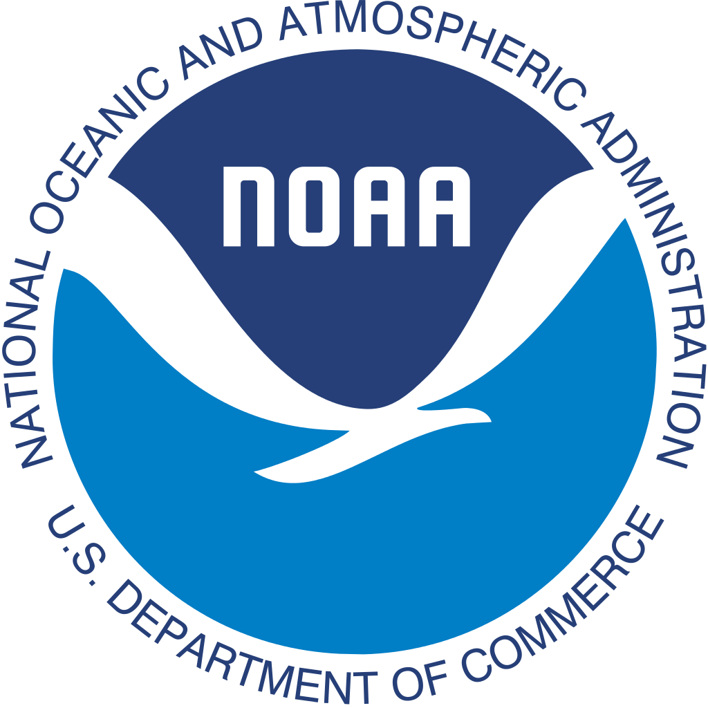

# Next Generation Water Resource Modeling Hydrofabrics 

This is the repository is designed to build hydrofabric artifacts for the NOAA Nextgen framework.

An introduction can be found [here](https://mikejohnson51.github.io/hyAggregate)

### Questions

Questions for this section can be answered using Github Issues and the tag "help wanted"

 

