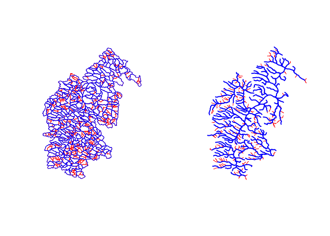
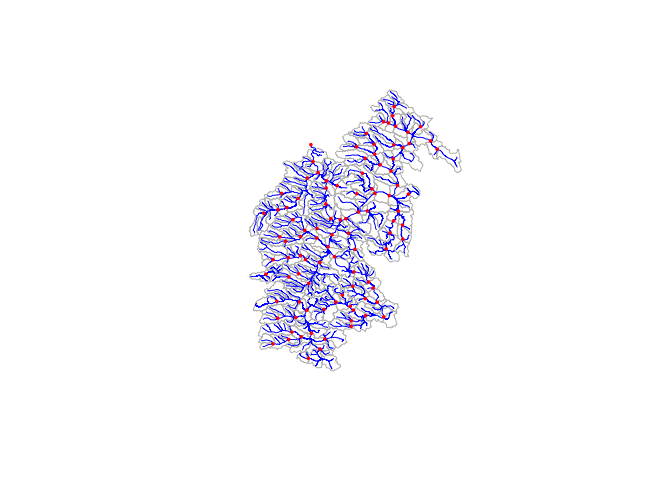

<!-- README.md is generated from README.Rmd. Please edit that file -->

# hyAggregate

<!-- badges: start -->

[](#)
[](https://github.com/mikejohnson51/hyAggregate/actions/workflows/R-CMD-check.yaml)
[](https://choosealicense.com/licenses/mit/)
[](https://lifecycle.r-lib.org/articles/stages.html#experimental)
<!-- badges: end -->

The goal of `hyAggregate` is to aggregate refactored (see
[hyRefactor](https://github.com/dblodgett-usgs/hyRefactor)) hydrologic
networks to meet user defined length and area minimum thresholds

## Installation

You can install the released version of `hyAggregate` from
[Github](https://CRAN.R-project.org) with:

``` r
remotes::install_github("mikejohnson51/hyAggregate")
```

## Example

This is a basic example which shows you how hyAggrgate works. The core
premise is that outputs from `hyRefactor` can be aggregated to meet
minimum catchment area and flowpath length criteria.

Here we aggregate the refactored network draining to USGS-01013500 to an
ideal size of 10sqkm, with a minimum allowable catchment area of 3sqkm
and a minimum allowable flowpath length of 1 km.

``` r
library(hyAggregate)
library(dplyr)
library(sf)

# -- load some sample data -- #
load(system.file("extdata", "gage_01013500.rda", package = "hyAggregate"))

# -- Run the Aggregation -- #
aggregated = aggregate_by_thresholds(fl = gage_01013500$flowpaths,
                                     catchments = gage_01013500$catchments,
                                     ideal_size = 10,
                                     min_area_sqkm = 3,
                                     min_length_km = 1)
```

Here we can view a map of the modified flowpath and catchment network.
Note that aggregating any network will result in lost resolution on the
network when data conforms to the HY_Feature standand.



Equally we can ensure that our criteria was met by evaluating the
catchment area and flowpath lengths across outputs:

    #> Warning: Removed 2 rows containing missing values (geom_bar).

    #> Warning: Removed 2 rows containing missing values (geom_bar).



## Nexus Locations

``` r
nex = get_nexus_locations(aggregated$flowpaths, term_cut = 1000000)

{
  plot(st_geometry(aggregated$catchments), border = "gray")
  plot(st_geometry(gage_01013500$flowpaths), col = "blue", add = TRUE)
  plot(st_geometry(nex), col = "red", pch = 16, cex = .5, add = TRUE)
}
```


