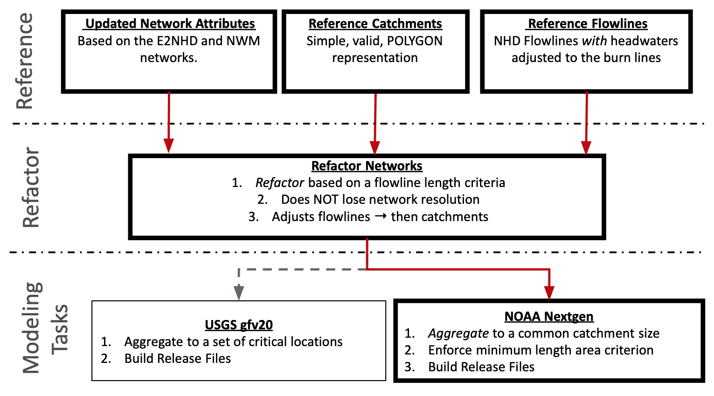
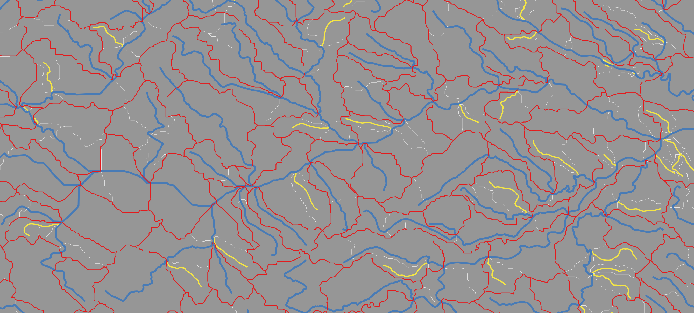
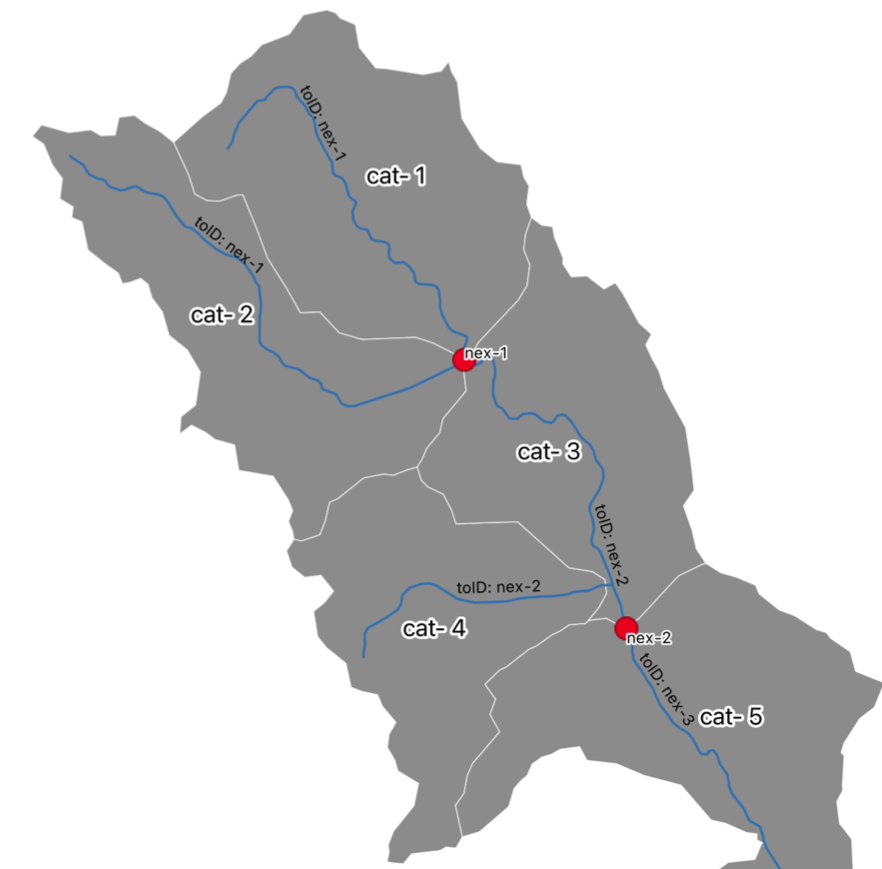

```{r, include = FALSE}
 knitr::opts_chunk$set(
  collapse = TRUE,
  comment = "#>",
  fig.path = "man/figures/README-",
  out.width = "100%"
)

devtools::load_all('.')
VPU = "01"
library(sf)
library(glue)
library(mapview)
mapviewOptions(fgb = FALSE)

```


# What is a hydrofabric?

The first question generally raised is, "_what is a "hydrofabric_"? To date, the term has been a bit nebulous and has been used to describe artifacts as narrow as a set of cartographic lines, all the way to encompass the entire spatial data architecture needed to map and model the flow of water and flood extents. 

Here, a "Ngen Hydrofabric" will include the following four parts:

1. The blue line (flowpaths) and per-flowline catchments **feature**

2. The flowline/catchment **topologies**

3. **Attributes** to support routing and runoff modeling

4. The **software** and **data models** to make the creation of these open, reproducible, and flexible.

In this breakdown, features _define_ the computational elements for hydrology and hydraulic modeling; topologies _link_ data together for space/time processing 
(modular elements that act as a whole); attributes _provide_ the information for model execution (physics based, conceptual and ML/AI model formulations); and software and data models _develop_ community standards, reproducibility, and flexibility to support analysis at scale.

```{r, echo=FALSE, fig.cap= "Figure 1"}
knitr::include_graphics('img/what-is-a-hydrofabric.png')
```

## Who cares about a hydrofabric?

Discritizing the land surface into computational elements is fundamental to all modeling tasks. Without it, distributed and lumped models have no way to apply the needed model formulations or computer science applications to achieve meaningful results. Therefore anyone who cares about the science and application of water resource modeling should care about the underlying data as it drives the locations where forecasts are made, the attributes that inform a model, and the spatial elements in which formulation are valid.

However, describing the earths surface - particularly at continental scales - is a tricky task. Automated techniques can get us a long way in representation, however the modeling task at hand and local knowledge should be used in developing an authoritative product. Through time, local knowledge has been collected in a number of places, but never centralized. Further, one off products (like the NHDPlus) have been used to guide all modeling task even in cases when its resolution, or representation is not well suited.

The aim of NOAAs work in this space is to develop a federal reference fabric to support all flavors of modeling, and a national instance of that reference fabric to support heterogeneous model application.

Equally important is the software tools to support flexibility and community uptake; the data models to support interoperability, community engagement, and long term stability; and a reference data set with the quality assurances that when one uses the product they are getting a well vetted resource that will be able to play nicely with the growing Ngen framework.

## Can I build my own?

Ngen aims to provide a framework in which heterogeneous models can be used to achieve the best possible results in the highest number of places. In the _framework_ the hydrofabric can is a malleable product that can be modified to support specific applications. However, the starting point for all variations of this product should stem from a consistent, quality _reference_ dataset. 

The central role of a reference dataset cannot be overstated as it not only allows people to avoid replication (and possible error) but also provides a source in which all variations of the data can be linked together. 

For example - while there might be specific hydrofabric traits needed for runoff modeling, hydraulic routing, and inundation mapping - if all of these groups built their own product from scratch, the ability to link them together to provide actionable information would take a a number of conflation processes that may or may not be easy, let alone feasible. 

Instead, if all groups were to start from a common reference system - and track the origins of that system - data conflation is simple meaning time can be spent on science rather then brute force data integration.


As part of NOAA's efforts to build Ngen, this reference fabric is being built with partners at the USGS, the private sector and the Internet of Water.

--- 

In addition to the reference fabric, software that uses this reference to support scale dependent modeling tasks are in development. The foundational layer of the Ngen model instance used as the National Water Model will be based on an authoritative instance of a hydrofabric that will dictate where forecasts are made, where model formulations are run, how the model engine passes data through time and space, and how model as a service visualizes, subsets, and disseminates data.

So, can you build your own? For now all of these products are under heavy development but are not close to final. The anticipated goal for finishing these products in a beta release are fiscal year 2023. When this time comes, you will be able to both generate your own modelling task based data product using the NOAA reference fabric and software tools, and/or utilize subsets of the fabric used for the operational modeling task.

In either case, building or finding a Ngen ready hydrofabric requires the `hyAggregate` R package that can be installed from Github:

```r
remotes::install_github("NOAA-OWP/hyAggregate")
```

The goal of `hyAggregate` is to find and/or develop _aggregated_ hydrologic and hydraulic networks to inform modeling tasks reliant on uniform length (flowpath) and area (catchment) distributions.

## Whats to follow:

In this document we illustrate the tool set for working with the established reference fabric to create Ngen ready data products. We focus on VPU 01 (east coast USA), as it is the most heavily tested. The workflow described here will work on any reference fabric artifact once they are produced, validated, and published to ScienceBase.

The following steps walk you through the concepts and tools for building a Ngen ready dataset, what the outputs look like, and how you might interact with them. `hyAggregate` is part of a larger family of projects and packages aiming to support federal (USGS/NOAA) water modeling efforts. The whole suite of development tools can be installed with:

```r
remotes::install_github("NOAA-OWP/hydrofabric")
```

Attaching this library, similar to the `tidyverse`, installs and loads a canon of software designed to manipulate, modify, describe, process, and quantify hydrologic networks and land surface attributes:

```{r, eval = FALSE, message=TRUE}
library(hydrofabric)
```

It includes the following:

| Repo        | Purpose           | 
| ------------- |:-------------:| 
| USGS-R/nhdplusTools      | Tools for for network manipulation | 
| dblodgett-usgs/hyRefactor      | Tools for network refactoring | 
| NOAA-OWP/hyAggregate      | Tools for distribution based network aggregation and Ngen file creation | 
| mikejohnson51/opendap.catalog      | Tools for for accessing remote data resources for parameter and attributes estimation | 
| NOAA-OWP/zonal      | Tools for rapid catchment parameter summarization | 


# A National Reference Fabric

`hyAggregate` relies on data products within the [Geospatial Fabric for National Hydrologic Modeling, version 2.0](https://www.sciencebase.gov/catalog/item/60be0e53d34e86b93891012b) project, the general outline of which, can be seen below:

```{r, fig.cap = "Figure 2", echo = FALSE, out.width = "75%"}

```

In the first row of Figure 2, there are three (3) **reference** products.

  1.  An updated _network attributes_ table that provides attributes for the network features in the data model of NHDPlusV2, but with substantial improvements based on contributions from the USGS, NOAA OWP, NCAR and others.
  
  2.  A set of _reference catchment_ geometries in which geometric errors and artifacts in the NHDPlus CatchmentSP layer are corrected/removed.
  
  3.  A set of _reference flowline_ geometries where headwater flowlines have been replaced with the NHDPlus Burn lines
  
The CONUS reference files for these datasets can be downloaded here respectively ([attributes](https://www.sciencebase.gov/catalog/item/60c92503d34e86b9389df1c9), [catchments](https://www.sciencebase.gov/catalog/file/get/61295190d34e40dd9c06bcd7?f=__disk__8b%2F4d%2Fe8%2F8b4de8b52d2d0b24a4b0ea40f17e6cd7cbb0a504), [flowpaths](https://sciencebase.usgs.gov/manager/item/61295190d34e40dd9c06bcd7/file/cl39kyiq2007y0vo1fdke9stf))
  
# A National Refactored Fabric

In the second row of Figure 2, the reference products are **refactored** based on a minimum flowpath criterion. This process is facilitated by the [`hyRefactor`](https://github.com/dblodgett-usgs/hyRefactor)^[Blodgett, D., Johnson, J.M., 2022, hyRefactor: Tools for Manipulating the NHDPlus Network in Preparation for Hydrologic Modeling]  R package. The concept of refactoring includes (1) Splitting large or long catchments in the reference data to create a more uniform catchment size distribution and (2) collapsing catchment topology by removing very small inter and intra confluence segments,  and to merge very small headwaters. The goal of refactoring is to **NOT** reduce the fidelity of the network, but instead to move the network to a more uniform/coherent version of the network.

As with all function from here on out, refactoring is a parameter-based workflow and the selection parameters _will_ impact the resulting network. For the National refactored fabric, the following were selected:

| Parameter        | Purpose           | Elected Value  | 
| ------------- |:-------------:| -----:| 
| split_flines_meters      | the maximum length flowpath desired in the output. | 10,000|
| collapse_flines_meters      | the minimum length of inter-confluence flowpath desired in the output. | 1,000 |
| collapse_flines_main_meters      | the minimum length of between-confluence flowpaths.| 1,000 |

The refactored output is shared under the Refactored Parent item of the above ScienceBase resource (available [here](https://www.sciencebase.gov/catalog/item/61fbfdced34e622189cb1b0a))


<br>
<br>

::: {#hello .blackbox .left}
**NOTE:**

There is a difference between the use of **flowline** and **flowpath**. Per the <a href="https://docs.opengeospatial.org/is/14-111r6/14-111r6.html">hy_features standard</a>, a catchment can have one primary <a href="https://docs.opengeospatial.org/is/14-111r6/14-111r6.html#_flowpath_also_flow_path">flowpath</a> (1:1) but multiple <a href="https://docs.opengeospatial.org/is/14-111r6/14-111r6.html#_flow_line_also_flowline">flowlines</a> (1:many). 

There is also a difference in the concept of a <a href="https://docs.opengeospatial.org/is/14-111r6/14-111r6.html#_catchment">catchment</a>, which is the holistic unit of hydrology, and a <a href="https://docs.opengeospatial.org/is/14-111r6/14-111r6.html#_catchment_divide"> catchment divide</a> which is the edge bounded by an inflown and outflow node

For the development of the reference fabric and modeling task outputs, we seek to define a set of divides and corresponding flowpaths from the reference flowlines and catchments.
:::
<br>
<br>

# Getting Reference & Refactored Data

All reference, refactored and Ngen hydrofabric archives live on ScienceBase. They can be accessed with the web interface or can be downloaded programatically.

The `hyAggregate::get_reference_fabric()` utility will download the most current geofabric for a Vector Processing Unit (VPU). Options include downloading the "refactored" (default) or "reference" data. If the requested file already exists the file path will be returned. Here we can find the local path to the reference fabric for VPU=01 in the `./data` directory, and explore the layers contained within:

```{r}
VPU = "01"
ref_file = get_reference_fabric(VPU = VPU, type = "reference", dir = "data")
st_layers(ref_file)
```

Within the reference fabric artifacts - the `reference_flowline` and `reference_catchment` layers are those associated with the reference data (row 1 in figure 2). (NOTE: In some artifacts, these are called `nhd_flowlines` and `nhd_catchments` per this [issue](https://code.usgs.gov/wma/nhgf/gfv2.0/-/issues/76))

We can also request the data products associated with the national refactor:

```{r}
file = get_reference_fabric(VPU = VPU, type = "refactored", dir = "data")
st_layers(file)
```

Within the refactored fabric artifacts - the `refactored_flowpaths` and `refactored_divides` layers are the output of the refactoring process (row 2 in figure 2). The remaining layers are those central to the `USGS gfv2.0` modeling task (row 3 in figure 2). (NOTE: In some artifacts, these are called `reconciled` and `divides` per this [issue](https://code.usgs.gov/wma/nhgf/gfv2.0/-/issues/76))


# NOAA NextGen Modeling Task

The NOAA Next Generation Water Resource Modeling Framework (Ngen) is a specific modeling task.  `hyAggregate` houses the workflow(s) for generating the needed output for the `NOAA NextGen` modeling task, that starts from the `refactored_flowpaths` and `refactored_divides` layers.

It operates under the assumption that there is no "one model to rule them all" and that different model **formulations** (e.g. topmodel, wrf-hydro, LSTM) will work better in different locations. Formulations are then **modules** that can execute at the scale of the catchment. The aim of the hydrofabric is to _encapsulate_ the higher level notion of a catchment (see the HY_features specification) such that a variety of hydraulic and hydrologic models can execute and exchange information.

```{r, echo = FALSE, out.width="75%"}
knitr::include_graphics("img/right-tool-right-place.png")
```

Because of the notion is to model the runoff process in a heterogeneous way, there is an interest in trying to align the **scale** of the catchment artifacts to the **scale** of the hydrologic processes being simulated. The scale identified for this initial run is the 3 - 15 square kilometers, with an ideal size of 10 sqkm.

As seen below, this is _not_ even close to the area/length distributions found in either the reference or refactored artifacts.

```{r, echo = FALSE, warning=FALSE, message = FALSE}
library(dplyr)
library(ggplot2)

reference = read_sf(ref_file, "reference_flowline") |> 
  st_drop_geometry() |> 
  select(areasqkm = AreaSqKM, lengthkm = LENGTHKM)

refactored_length = read_sf(file, "refactored_flowpaths") |> 
  st_drop_geometry() |> 
  select(ID, lengthkm = LENGTHKM)

refactored = read_sf(file, "refactored_divides") |> 
  st_drop_geometry() |> 
  select(ID, areasqkm) |> 
  left_join(refactored_length, by = 'ID')

ggplot() + 
  geom_density(data = reference, aes(x = areasqkm), color="#69b3a2", size = 2) + 
  geom_density(data = refactored, aes(x = areasqkm), color= "#404080", size = 2) + 
  xlim(0,25) +
  ylim(0,.6) +
  geom_vline(xintercept = 3) + 
  geom_vline(xintercept = 10, size = 1) + 
  geom_vline(xintercept = 15) + 
  theme_light() + 
  labs(x = expression("Area (km²)"),  title = "Area Distribution", 
       subtitle = paste0(sum(reference$areasqkm >= 25), ' catchments removed from reference (>25 km²)\n',
                         sum(refactored$areasqkm >= 25), ' divides removed from refactored (>25 km²)')) +
  annotate("rect", xmin = 3, xmax = 15, ymin = 0, ymax = .6,  alpha = .1) + 
  scale_y_continuous("Density", expand = c(0,0)) + 
  geom_label( aes(x=10, y=0.5, label= "Idealized Range"), color="black") +
  geom_label( aes(x=4, y=0.4, label=paste(nrow(reference), "\nreference catchments")), color="#69b3a2", fill = "white") +
  geom_label( aes(x=6.5, y=0.2, label= paste(nrow(refactored), "\nrefactored divides")), color="#404080") 

###

ggplot() + 
  geom_density(data = reference, aes(x = lengthkm), color="#69b3a2", size = 2) + 
  geom_density(data = refactored, aes(x = lengthkm), color= "#404080", size = 2) + 
  xlim(0,10) +
  ylim(0,.75) +
  geom_vline(xintercept = 1, size = 1) + 
  theme_light() + 
  labs(x = "Length (km)", y = "Density",  title = "Length Distribution", 
       subtitle = paste0(sum(reference$lengthkm >= 10), ' flowlines from reference (>10 km)\n',
                         sum(refactored$lengthkm >= 10), ' flowpaths removed from reference (>10 km)')) +
  geom_label( aes(x=1, y=0.75, label= "Minimum Length"), color="black") +
  geom_label( aes(x=2, y=0.5, label=paste(nrow(reference), "\nreference flowlines")), color="#69b3a2", fill = "white") +
  geom_label( aes(x=5, y=0.2, label= paste(nrow(refactored), "\nrefactored flowpaths")), color="#404080")

```


## Process

To overcome the mismatched scale in the reference/reference fabric and the Ngen modelling task, we need to aggregate the catchments to a defined user threshold/distribution. Therefore, Ngen is a **distribution based modeling task** that seeks to align the scale of process to scale of catchment representation. 

`hyAggregate` allows users to prescribe an **ideal catchment size**, a **minimum catchment area**, and a **minimum flowpath length**. The default parameters used for Ngen are an ideal catchment size of 10 km², a minimum catchment size of 3 km², and a minimum flowpath length of 1 km. A `refactored_fabric` can be aggregated to this distribution using `hyAggregate`:


```{r, eval = TRUE}
ngen_v1 =  aggregate_network_to_distribution(gf = get_reference_fabric(VPU = VPU, dir = "data"),
                             outfile = glue("data/01_ngen_{VPU}.gpkg"), 
                             nexus_topology = FALSE) 

st_layers(ngen_v1)
```

You'll see that aggregating the network to this scale requires _losing_ resolution of the network. In its current iteration Ngen requires a 1:1 flowpath to catchment relationship. In time the ability to support 1:many relationship will be developed so that the flowpath and/or catchment network can be densified in areas where it is needed. Until then, the 1:1 requirement mean that for each catchment a primary mainstem must be elected, and it is this mainstem only that is reflected in the final aggregated product.


The outputs of the base `hyAggregate` function create a [geopackage](https://www.geopackage.org) with a set of catchment and flowpath features. Below we see the desired distribution has been enforced on the resulting hydrofabric. A more complete discussion of what happens within the aggregation can be found in the code and will be documented latter on.


```{r, echo = FALSE, warning=FALSE, message = FALSE}
agg = read_sf(ngen_v1, "aggregate_flowpaths") |> 
  st_drop_geometry() |> 
  select(areasqkm, lengthkm)


ggplot() + 
  geom_density(data = reference, aes(x = areasqkm), color="#69b3a2", size = 2) + 
  geom_density(data = refactored, aes(x = areasqkm), color= "#404080", size = 2) + 
  geom_density(data = agg, aes(x = areasqkm), color= "red", size = 2) + 
  xlim(0,25) +
  ylim(0,.6) +
  geom_vline(xintercept = 3) + 
  geom_vline(xintercept = 10, size = 1) + 
  geom_vline(xintercept = 15) + 
  theme_light() + 
  labs(x = expression("Area (km²)"),  title = "Area Distribution", 
       subtitle = paste0(sum(reference$areasqkm >= 25), ' removed from reference (>25 km²)\n',
                         sum(refactored$areasqkm >= 25), ' removed from refactored (>25 km²)\n',
                         sum(agg$areasqkm >= 25), ' removed from ngen (>25 km²)\n')) + 
  annotate("rect", xmin = 3, xmax = 15, ymin = 0, ymax = .6,  alpha = .1) + 
  scale_y_continuous("Density", expand = c(0,0)) + 
  geom_label( aes(x=10, y=0.5, label= "Idealized Range"), color="black") +
  geom_label( aes(x=4, y=0.4, label=paste(nrow(reference), "\nreference catchments")), color="#69b3a2", fill = "white") +
  geom_label( aes(x=6.5, y=0.2, label= paste(nrow(refactored), "\nrefactored divides")), color="#404080") +
  geom_label( aes(x=15, y=0.1, label= paste(nrow(agg), "\naggregate divides")), color="red") 


ggplot() + 
  geom_density(data = reference, aes(x = lengthkm), color="#69b3a2", size = 2) + 
  geom_density(data = refactored, aes(x = lengthkm), color= "#404080", size = 2) + 
  geom_density(data = agg, aes(x = lengthkm), color= "red", size = 2) +
  xlim(0,10) +
  ylim(0,.75) +
  geom_vline(xintercept = 1, size = 1) + 
  theme_light() + 
  labs(x = expression("Length (km)"),  title = "Length Distribution", 
       subtitle = paste0(sum(reference$lengthkm >= 10), ' removed from reference (>10 km)\n',
                         sum(reference$lengthkm >= 10), ' removed from refactored (>10 km)')) +
  geom_label( aes(x=1, y=0.75, label= "Minimum Length"), color="black") +
  geom_label( aes(x=2, y=0.6, label=paste(nrow(reference), "\nreference flowlines")), color="#69b3a2", fill = "white") +
  geom_label( aes(x=4, y=0.35, label= paste(nrow(refactored), "\nrefactored flowpaths")), color="#404080") +
  geom_label( aes(x=6, y=0.2, label= paste(nrow(agg), "\naggregate flowpaths")), color="red")

```

Below is a spatial view of this process. The gray catchments with white outlines are the "refactored_divides" while the yellow
lines are the "refactored_flowpaths". The red, hollow catchments are the "aggregated_divides" while the blue lines are the "aggregated_flowpaths". This image hopefully illustrates the level of manipulation that occurs in network as a result of the requested parameters. When viewing this image the white visible edges are dissolved and the yellow flowpaths are dropped. In cases where catchments are dissolved, the associated flowpaths and topologies are modified to reflect the changes.

```{r, echo = FALSE}

```

## Distrubution and mapping

All core hydrofabric data is distributed as a geopackage segmented by vector processing unit. Geopackages are spatial databases that can be used with many [software suites](https://www.geopackage.org/implementations.html), as well as programming languages that call GDAL (e.g. R, python, Rust). Once read in, the data layers can be mapped with base products, packages (In R, sf, ggplot2, leaflet, mapview -- In python fiona, geopandas, geoplot, matlibplot, etc), and GUI's (QGIS).

In R, here is are a few basic examples:

### Base Plot
```{r}
agg = read_sf(ngen_v1, "aggregate_flowpaths") 
plot(agg$geom)
```

### Crop and plot

```{r}
#Define area and project to same Coordinate Reference System
AOI = AOI::aoi_get("Boston") |> 
  st_transform(st_crs(agg))

boston_flow = st_intersection(agg, AOI)

plot(boston_flow$geom)
plot(AOI$geometry, add = TRUE)
```

### Interactive Plot

```{r}
mapview::mapview(boston_flow)
```


In [QGIS](https://qgis.org/en/site/forusers/download.html), double clicking the gpkg file will allow you to select which layers to load.

## Topology

The flowpath/divides produced in the aggregation provide the features that discritize the landscape and river network into the computational elements that will be used. The next construct is that we need a description of how these features are connected and which 

To date, the NHDPlus topology (and many other flow network models) rely on flowpath-to-flowpath connectivity that describes the network in terms of how flowpaths connect to other flowpaths (therefore, which divides connect to other divides). The reference _and_ refactored products retain this 'flowline-to-flowline' connectivity as does the ngen_aggregation when `nexus_topology=FALSE`.

```{r}
topology = read_sf(ngen_v1, 'aggregate_flowpaths') |> 
  st_drop_geometry() |> 
  select(id, toid)

head(topology)
```

```{r, echo = FALSE}
# Get the first id/toid relation:
example = read_sf(ngen_v1, 'aggregate_flowpaths') |> 
  filter(id %in% topology[1,])

agg_cat = read_sf(ngen_v1, "aggregate_divides") |> 
  filter(id %in% topology[1,])

ggplot(data = example, aes(color = as.factor(id))) +
   geom_sf(size = 4) + 
   labs(title = "Row 1 of the Topology Table:",
        subtitle  = glue("Flowpath {topology$id} flows to Flowpath {topology$toid}"),
        color = "ID") + 
  theme_light() + 
  theme(legend.position = "bottom")
```

**Ngen** is moving away from 'flowline-to-flowline' model towards 'area-to-point' model. Here the idea of 'area' is wrapped up into the holistic idea of a HY_feature catchment and 'point' is captured by the conceptual idea of a hydro nexus.


::: {#hello .blackbox .left}
**<a href="https://docs.opengeospatial.org/is/14-111r6/14-111r6.html#_catchment">hydro(-logic) Catchment</a>:**

A physiographic unit where hydrologic processes take place. This class denotes a physiographic unit, which is defined by a hydrologically determined outlet to which all waters flow. While a catchment exists, it may or may not be clearly identified for repeated study. This approach considers the catchment concept to be the basic unit of study in hydrology, water resources management, and environmental reporting. The approach is meant to be holistic, referring to the continuous interaction of surface and subsurface waters within a catchment, even if a particular representation of the catchment refers to only surface or subsurface aspects of the catchment. 

**<a href="https://docs.opengeospatial.org/is/14-111r6/14-111r6.html#_hydro_logic_nexus">hydro(-logic) nexus</a>:**

Conceptual outlet for water contained by a catchment. The hydro nexus concept represents the place where a catchment interacts with another catchment. Every catchment flows to a hydro nexus, conversely every location in a hydrologic system can be thought of as a hydro nexus that drains some catchment. Similar to catchments, hydro nexuses can be realized in several hydrology-specific ways.

If a given hydro nexus does not have a known hydrology-specific realization or is undetermined, it is termed 'nillable' in this standard. For example, a hydro nexus exists in the form of flow to the subsurface or atmosphere but may be undetermined and unrepresented within implementations focused on surface water hydrology and would not be included or referenced.
:::
<br>
<br>

We are doing this to be more compliant with the HY_Features conceptual model for representing surface water components and to ultimately help develop the community _data model_ needed for implementing the hy_feature concepts. This type of flow model was needed due to the scale of aggregation Ngen requires, and the 


The long term advantage of this approach is the ability to use multi-scale networks, leverage community efforts in hydrologic addressing and representation, and to have a more defined computational element for Ngen comparability.

In practice, this yields a scenario like below, where catchments may not flow to the coincident catchment but sometimes to the _downstream_ nexus. This is highlighted where 'cat-4' not longer flows to 'cat-3' but instead to 'nex-2'. At the same time, 'cat-3' is _also_ flowing to 'nex-2' suggesting two areas (holistic catchments) are flowing to one point (a hydro nexus).

<br>
<br>
```{r, echo = FALSE, out.width="50%"}

```
<br>
<br>


## Implied Nexus Locations

There are two principle types of nexus locations, those that are implied by the network, and those that occur at locations of interest (hydrolocations). So far, Ngen only works with the first. To generate the 'nexus_topology' (opposed to flowline) and materialize the implied nexus locations, we can set the `nexus_topology=TRUE` and rerun the aggregation code.

```{r, eval = TRUE}
ngen_v2 = aggregate_network_to_distribution(
        gf = get_reference_fabric(VPU = VPU, dir = "data"),
        outfile        = glue("data/02_ngen_{VPU}.gpkg")) 

st_layers(ngen_v2)
```

This option produces a non-spatial "flowpath_edge_list" table layer within the geopackage. Opening this table highlights the area to point topology where the area (holistic catchment) is _realized_ as the waterbody ('wb-') of the flowpath. 

```{r}
head(read_sf(ngen_v2, 'flowpath_edge_list'))
```

The choice to use the waterbody realization, is tied to the need for network topology to support hydrologic and hydraulic routing.

## Routing Attributes 

The core of the Ngen modeling system uses [t-route](https://github.com/NOAA-OWP/t-route) for hydrologic and hydraulic routing. `t-route`  was designed to support the existing NWM and as such relies on routing parameters defined in the NWM Routelink file. 

The `get_routelink_path()` function will search your `hyAggregate` R directory for a fst representation of the most current routelink file. If this file does not exist, then the code will (1) Check for the latest version of the nwm domain files on ncep. (2) Download the NetCDF file (3) extract it into a [fst](https://www.fstpackage.org) file shown below, and (4) save it to the specified directory.

```{r, warning = FALSE, message = FALSE}
path = get_routelink_path()
fst::metadata_fst(path)
```

By specifying a `routelink_path`, `aggregate_network_to_distribution` knows to develop length-averaged routelink parameters and associations (gages and NHDWaterbodies). The length averaging is done by determining the proportion of each _reference_ flowline (COMID) that falls within each aggregated catchment. The associated values are then weighted by the relative length:

```{r, eval = TRUE}
ngen_v3 =  aggregate_network_to_distribution(
        get_reference_fabric(VPU = VPU, dir = "data"),
        outfile        = glue("data/03_ngen_{VPU}.gpkg"),
        nexus_topology = TRUE,
        routelink_path = get_routelink_path())
```

Lets peak at the developed layers and the contents of the new flowpath_attributes table: 

```{r}
st_layers(ngen_v3)

head(read_sf(ngen_v3, 'flowpath_attributes'))
```

## Hydrologic Model Attributes

While routing parameters and topologies are critical for modeling the flow of water, `runoff` formulations are critical for simulating how much water will be in the channel.

The capacity for Ngen to encapsulate the idea of a catchment and implement a suite of different model formulations requires that critical attribute information is available to inform the wide range of models.

Since Ngen runs runoff models at the catchment scale, and not at the gridded scale (at least as of now), there is a need to summarize gridded information to the catchment scale in a fast, flexible, and performant way.

This requires the ability to identify and  then quickly and accurately summarizes raster values over polygonal areas including partially covered grid cells. Once the divide/raster cell relationships are established, we must define the way in which those values are summarized (collapsed). For example, do we want the "max temperature per catchment" or the "mean temperature per catchment"?

For more information on how this is accomplished please see the [zonal package](https://github.com/NOAA-OWP/zonal) which has produced the ability to summarize decades of data, for areas as large as the east coast, in minutes on a personal laptop (this package is included in the `hydrofabric` meta package).

----


For the initial Ngen modules (cfe and NOAH-OWP-modular) the following variables from the NWM gridded data are summarized using the following functions:


| Tables        | Description           | Layer(s)  | Summary Function | Source | 
| ------------- |:-------------:| -----:| -----:| -----:|
| bexp      | Beta Parameter| 4 | mode | soilproperties_CONUS_FullRouting.nc |
| IVGTYP      | Dominant category    | 1   | mode | wrfinput_CONUS.nc |
| ISLTYP | Dominant category      |  1   | mode | wrfinput_CONUS.nc |
| dksat      | Saturated Soil Connectivity | 4  | geometric mean | soilproperties_CONUS_FullRouting.nc |
| psisat      | Saturated soil matric potential      | 4   | geometric mean | soilproperties_CONUS_FullRouting.nc |
| slope | Slope Index      |   1 | mean | soilproperties_CONUS_FullRouting.nc |
| smcmax      | Saturated value of soil moisture [volumetric] | 4 | mean | soilproperties_CONUS_FullRouting.nc |
| smcwlt      | Wilting point soil moisture [volumetric]     |  4  | mean | soilproperties_CONUS_FullRouting.nc |
| refkdt | Parameter in the surface runoff parameterization      |  1  | mean | soilproperties_CONUS_FullRouting.nc |
| cwpvt      | Empirical canopy wind parameter | 1 | mean | soilproperties_CONUS_FullRouting.nc |
| vcmx25      | Maximum rate of carboxylation at 25 C [ umol CO2/m2/s]      | 1  | mean | soilproperties_CONUS_FullRouting.nc |
| mp | Slope of Conductance to photosynthesis relationship      | 1   | mean | soilproperties_CONUS_FullRouting.nc |
| mfsno      | Snowmelt m parameter | 1 | mean | soilproperties_CONUS_FullRouting.nc |
| Coef      | Coefficient | 1 | mean | GWBUCKPARM_CONUS_FullRouting.nc |
| Zmax      | Zmax | 1 | mean | GWBUCKPARM_CONUS_FullRouting.nc |
| Expon      | Exponent | 1 | mode | GWBUCKPARM_CONUS_FullRouting.nc |
 

For convenience, these layers have been combined and stored as a single NetCDF on [ScienceBase](https://www.sciencebase.gov/catalog/item/629a4246d34ec53d276f446d). The get
`get_nwm_grids` function in hyAggregate will either return a `file.path` if it exists in the provided directory; download the cached file from ScienceBase (if cache_download = TRUE); or, build it from the files available on NCEP.

This summarization is wrapped in the function `aggregate_cfe_noahowp`, but can be reworked using `zonal` if more variables, or different summary functions are desired:

```{r, eval = TRUE}
ngen_v4 = glue("data/04_ngen_{VPU}.gpkg")
#file.copy(ngen_v3, ngen_v4)
```

```{r, eval  = FALSE}
ngen_v4 = aggregate_cfe_noahowp(gpkg = ngen_v4, dir = 'data', add_to_gpkg = TRUE)
```

```{r, eval = TRUE}
st_layers(ngen_v4)

dplyr::glimpse(read_sf(ngen_v4, 'cfe_noahowp_attributes'))

tmp = left_join(read_sf(ngen_v4, "aggregate_divides"), read_sf(ngen_v4, "cfe_noahowp_attributes"), by  = "id")

ggplot() + 
  geom_sf(data = tmp, aes(fill = gw_Zmax), color = NA) + 
  scale_fill_viridis_c()

```

### Coming Soon...

Soon we will be producing the data, weight grids, and routines to produce and validate all attributes from [CAMELS](https://ral.ucar.edu/solutions/products/camels) for a given, arbutrary Nextgen catchment. This will aim to support machine learning models and further extend the parameter space that model formulation have access too. When complete the weight grids and parameters will be added to the released geopackages.

National aggregates will also be produced as parquet files to support more optimal cloud based data access and visualization routines.

# Working with the Geopackages

It is worth highlighting that the geopackage is a critical file format for sharing this type of data because it is (1) self containing (2) compact and (3) language agnostic.  There are two broad paths to accessing the data. The first is a GDAL based approach (in R this is using sf, but in python Fiona or geopandas works well). 

```{r}
# Read Options
pacman::p_load(sf, DBI, RSQLite, dplyr)

### 1. GDAL/geopackage
st_layers(ngen_v4)
nex = read_sf(ngen_v4, "nexus")
head(nex)
```

The second is as a SQLite database (in R, I am doing this with RSQLite/DBI/dplyr):

```{r}
### 2. SQLite/Database
db <- dbConnect(SQLite(), ngen_v4)
dbListTables(db)
fpa = collect(tbl(db, "flowpath_attributes"))

head(fpa)

dbDisconnect(db)
```

## GPKG -->  Nextgen Output

While the geopackage serves as a concise, interoperaple, and efficient format for distributing packaged data that is tabular and spatial it does not meet everyone's need. In particular ngen operates using JSON/geoJSON files. Similarly the ESRI family of tools (e.g. ArcMap/ArcPro/ArcGIS Online) _cannot_ read geopackges.

As such, we offer a final function that generates ngen files, and optionally shapefiles, from a final GPKG.

```{r, eval = FALSE}
write_ngen_dir(ngen_v4, export_shapefiles = TRUE)
```

This function creates a directory at the same level and named as the GPKG and outputs the following files:

```{r}
fs::dir_tree(glue("data/04_ngen_{VPU}"))
```


# Cross-walk

If you have made it this far - thanks! A small detail you might notice is that in the `data/ngen_01` directory created from the GPKG, there is a new file called `crosswalk-mapping.json`.

This file is critical for data disambiguation, mapping the output files to the original NHD comids (NWM forecasts locations), to finding NWIS stream gages, 
and to linking maistem IDs to the PIDs within the Internet of Water knowledge graph. Looking in this file we find a nested list object:

```{r}
library(jsonlite)
cw = fromJSON('data/04_ngen_01/crosswalk-mapping.json')
length(cw)
```
In this crosswalk, all features have an outlet comid, member comids (when aggregated) and a Mainstem Identifier. Remember COMIDs are the "common identifier in the NHDPlus and were carried into the reference fabric: 

```{r}
cw$`wb-16354`
```
Some, have reference to a USGS gage if it is located along the flowpath:

```{r}
# Feature gage
cw$`wb-22117`
```

## Mapping to the NWM 42 year retrosepctive

Bty providing the outlet of each aggregated feature, we are able to extract stream flow from the 42 year retrospective run of the NWM, this is advantageous when trying to compare output from Nextgen experiments to the current state of the art. [`nwmTools`](https://github.com/mikejohnson51/nwmTools) allows you to subset the reanalysis product by time and NHDPlus COMID.

```{r}
library(ggplot2)
nwm = nwmTools::readNWMdata(comid = cw$`wb-17307`$outlet_comid)

ggplot() + 
  geom_line(data = nwm, aes(x = dateTime, y = flow_cms_v2.1)) + 
  theme_light() + 
  labs(x = 'DateTime', y = "Q (cms)", title = "NWM v2.1 Q at the outlet of wb-17307")
```

## Mapping to the NHDPlusV2 data

The cross walk also reports the collection of "member_comids" that have been aggregated into a single feature. Often there is an interest in extracting these original features which is possible with the nhdplusTools get_* family:

```{r}
data = nhdplusTools::get_nhdplus(comid = cw$`wb-16354`$member_comids)

plot(data['comid'])
```

## Future Work:

For now, we are only indexing NWIS stations based on there COMID mapping in the NWM routelink file. As we make more progress, the crosswalk file will contain references to the POIs created as part of the reference fabric seen below.

```{r}
catchments = sf::read_sf(ngen_v4, "aggregate_divides")
pois = sf::read_sf(ref_file, 'POIs')

grep("Type_", names(pois), value = TRUE)

mapview(catchments) + pois
```

The indexing of these locations will not only provide more opportunity for modeling tasks and more realistic network aggregation, but it will allow for the inclusion of explicit and implicit nexus selection in the Ngen hydrofabric.

# Network Tracing

So the last step here is a non-function-ized way to use these files in conjunction to subset the network based on the flowpaths that flow to a USGS gage.

In the above code chunk, we saw that `wb-16354` was associated with `NWIS:01172010`. To find the network upstream of that gage, we can use the topology (edge list) and the determined identifier to 'sort' the network. The returned results is a sorted set of IDs upstream of the provided outlet. These IDs can then be used to extract the flowpath or divide network.

```{r}
library(nhdplusTools)

system.time({
  trace = get_sorted(read_sf(ngen_v4, 'flowpath_edge_list'), 
                     split = TRUE, 
                     outlets = 'wb-16354')
  
  flowpaths = filter(read_sf(ngen_v4,  'aggregate_flowpaths'), id %in% trace$id)
})

plot(st_geometry(flowpaths), main = paste(nrow(flowpaths), "flowpaths upstream of 'wb-16354'"))
```

# Questions

The `hyAggregate` repo has a "help wanted" tag that can be applied to Issues. I am hopeful the communitee can engage there, ask questions, point out all the things that we have wrong (I likely own all the mistakes `r emo::ji("smile")`). Otherwise please email me at [mike.johnson@noaa.gov](mike.johnson@noaa.gov].
